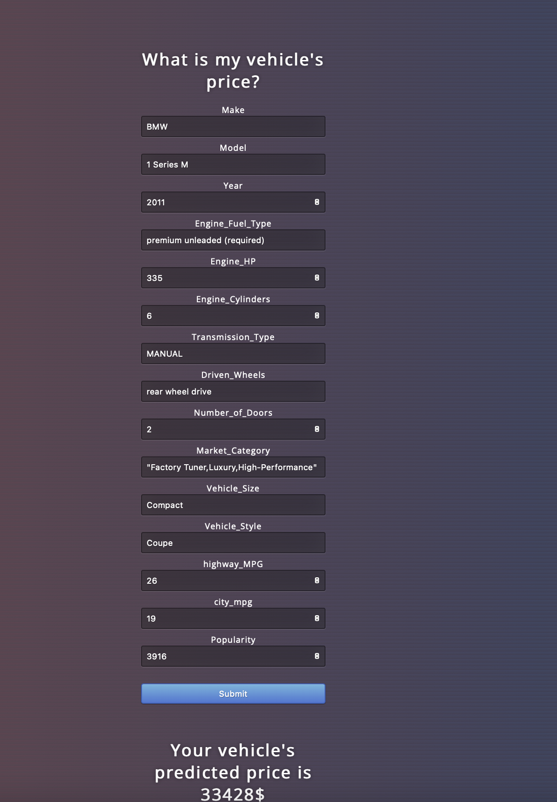

# FastAPI based Vehicle Price Prediction

Project includes

- Data analysis, visualization and ML model building as a Jupyter notebook.
- Training file that pickles the ML model.
- FastAPI backend with user interface which accepts vehicle parameters and predicts a price.



# Instructions


### 1. Build the docker image

```
docker build -t vehicle-ml-build .
```

### 2. Run the container

```
docker run -d -p 80:80 --name vehicle-api vehicle-ml-build 
```

### 3. Run Pytest with coverage
```
docker exec -it vehicle-api pytest --ignore=tests/ --cov=app tests/ --cov-config=.coveragerc
```

### 4. Go to localhost
http://127.0.0.1/docs


### 5. Try out the post /predict_endpoint method
```
curl -X POST "http://127.0.0.1/predict_endpoint" -H\
 "accept: application/json"\
 -H "Content-Type: application/json"\
 -d "{\"data\":[...insert data here...]}"
```
